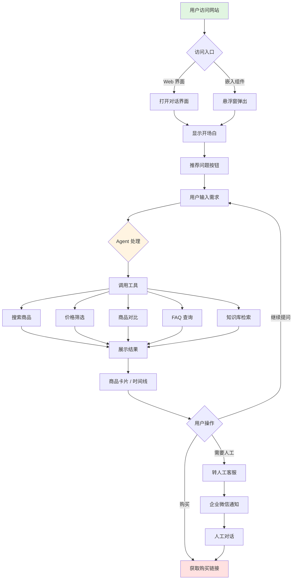
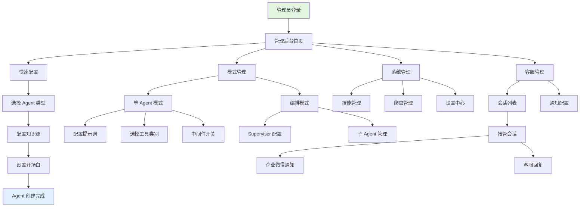
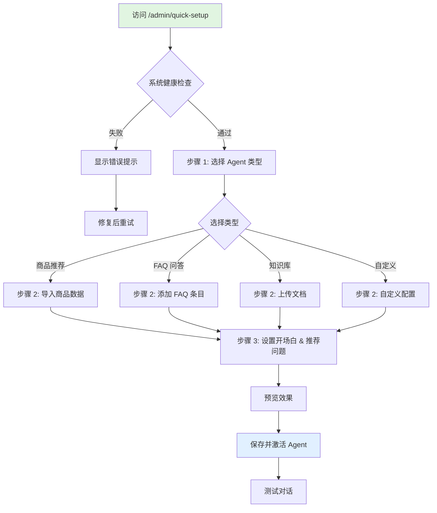

# 功能详解

本文档是 README 的扩展，收录了四种 Agent 类型的详细说明、记忆系统介绍、后台管理模块一览以及完整的功能流程图。

---

## 🤖 四种 Agent 类型

### 1. 商品推荐助手（Product Agent）

**适用场景**：电商网站、商品导购、购物咨询

**核心能力**：
- 🔍 **智能搜索** — 理解自然语言需求，精准匹配商品
- 💰 **预算筛选** — 按价格区间自动过滤
- 📊 **商品对比** — 横向对比多款商品的参数和优劣
- 🏷️ **分类浏览** — 按品类、品牌、用途探索商品
- ⭐ **精选推荐** — 推荐热门、高评分商品
- 🔗 **相似推荐** — 找到类似款式或功能的替代品
- 🛒 **购买引导** — 提供购买链接和下单指引

**典型对话**：
- "帮我找 3000 元以内适合跑步的耳机" → 推荐运动耳机列表
- "索尼和 Bose 降噪耳机哪个好？" → 详细对比表格
- "这款有什么颜色？" → 查看商品详情和规格

---

### 2. FAQ 问答助手（FAQ Agent）

**适用场景**：客服系统、售后支持、常见问题解答

**核心能力**：
- 📚 **FAQ 检索** — 从知识库快速找到最相关的答案
- 🎯 **精准匹配** — 理解问题意图，匹配最佳答案
- 💬 **多轮澄清** — 问题不明确时主动追问
- 👨‍💼 **人工转接** — 无法回答时引导人工客服

**典型对话**：
- "如何退货？" → 返回退货政策和流程
- "发货需要多久？" → 查找物流相关 FAQ
- "会员有什么优惠？" → 展示会员权益说明

---

### 3. 知识库助手（KB Agent）

**适用场景**：企业内部知识库、文档检索、技术支持

**核心能力**：
- 📖 **文档检索** — 从海量文档中找到相关内容
- 🔎 **语义搜索** — 理解查询意图，不局限于关键词
- 📌 **引用来源** — 回答时标注文档出处
- 🎓 **知识整合** — 综合多个文档给出完整答案

**典型对话**：
- "如何配置 SSL 证书？" → 从技术文档中检索步骤
- "公司的报销流程是什么？" → 查找内部制度文档
- "这个 API 怎么调用？" → 返回 API 文档和示例

---

### 4. 自定义助手（Custom Agent）

**适用场景**：特殊业务需求、混合场景、实验性功能

**可自定义项**：
- **知识源**：绑定任意已有的 KnowledgeConfig（商品库 / FAQ / 向量文档 / 混合源）
- **工具能力**：多选"搜索/查询/比较/筛选/FAQ 搜索/知识库搜索"等能力组合
- **中间件策略**：独立控制 16 个中间件（TODO 规划、上下文压缩、模型重试、模型降级、工具重试、记忆系统等）
- **提示词 & 开场白**：自带模板，可按业务编辑系统提示、欢迎语、推荐问题
- **渠道策略**：嵌入组件和客服面板可独立控制展示、按钮、唤起动作

---

## 🧠 智能记忆系统

| 类型 | 功能 | 示例 |
|------|------|------|
| **👤 用户画像** | 记住用户的偏好和习惯 | 记住"喜欢苹果品牌"、"预算通常在 3000 左右" |
| **📝 事实记忆** | 存储对话中的关键事实 | 记住"上次看过索尼 XM5" |
| **🕸️ 知识图谱** | 建立实体之间的关联 | 关联"用户 → 喜欢 → 降噪耳机" |

---

## 🔧 后台管理模块

| 模块 | 功能 |
|------|------|
| **🎯 快速配置** | 可视化向导，3 步完成 Agent 配置（推荐新手使用） |
| **🤖 Agent 配置** | 单 Agent 模式配置，设置提示词、工具、中间件 |
| **🔀 编排配置** | 多 Agent 编排模式，Supervisor 路由与子 Agent 管理 |
| **🎭 技能管理** | AI 智能生成技能，动态注入 Agent |
| **📝 提示词管理** | 统一管理系统提示词模板 |
| **🕷️ 爬虫管理** | 自动从网站抓取商品信息（支持 SPA） |
| **💬 会话管理** | 查看所有对话记录、用户信息、消息统计 |
| **👤 用户管理** | 用户列表、画像查看 |
| **⚙️ 设置中心** | LLM 配置、系统参数、模式切换 |
| **👨‍💼 客服工作台** | 人工客服介入、企业微信通知、消息编辑、撤回、重新生成 |

---

## 📊 功能流程图

### 用户侧完整流程

---

### 管理侧完整流程

---

### 快速配置（Quick Setup）流程

